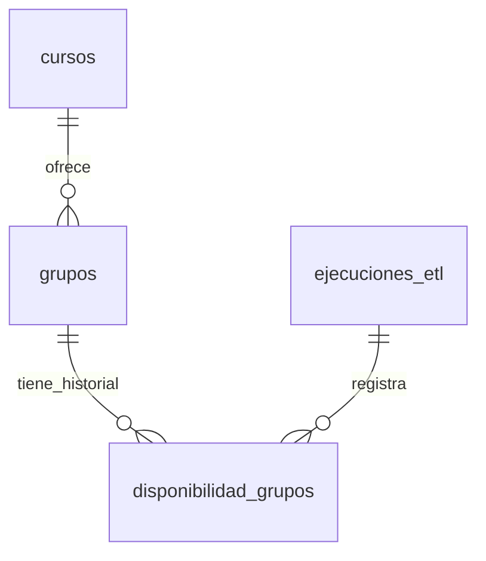

# Scraper de Cursos

Script en Python para extraer información de grupos y cupos de cursos desde la plataforma.

## Descripción

El script lee una lista de URLs de inscripción desde un archivo CSV y, para cada una, obtiene:
- Los grupos disponibles (curso, país, idioma, horario, días, etc.)
- El estado de cupos (total y disponible) mediante una consulta adicional a la API

## Requisitos

- Python 3.8 o superior
- Librería `requests` (instalar con `pip install requests`)

## Uso

1. Crea o edita el archivo `urls.csv` con una columna `url` (o la primera columna del archivo) conteniendo las URLs de inscripción, una por línea.

2. Ejecuta el script:

```bash
python scraper.py
```

3. Los resultados se guardan en `cursos_scrapeados.csv`.

## Estructura de salida

El CSV resultante contiene las siguientes columnas:

| Columna | Descripción |
|---------|-------------|
| `convocatoria` | Identificador de convocatoria (parte 1 de la URL) |
| `tema_id` | Identificador del tema (parte 2 de la URL) |
| `periodo` | Período (parte 3 de la URL) |
| `curso` | Nombre del curso |
| `pais` | País del curso |
| `idioma` | Idioma |
| `idGrupo` | Identificador del grupo |
| `codigoGrupo` | Código del grupo |
| `dias` | Días de clase (separados por coma) |
| `horario` | Horario de clase |
| `zonaHoraria` | Zona horaria |
| `tipoGrupo` | Tipo de grupo |
| `cupoTotal` | Cupo total del grupo |
| `cupoDisponible` | Cupo disponible |
| `tieneCupos` | "Sí" o "No" según haya cupos disponibles |

## Notas

- El script incluye un delay de 1.5 segundos entre requests para respetar al servidor.

## Base de datos PostgreSQL

El CSV es útil como resultado inicial, pero la versión ETL del proyecto guarda el
histórico de cupos en PostgreSQL. El modelo evita repetir los datos descriptivos de
cursos y grupos, y almacena una observación de disponibilidad por cada ejecución.

### Modelo de relaciones



- `cursos`: información estable de cada curso dentro de una convocatoria.
- `grupos`: información relativamente estable de cada grupo, identificado por
  `id_grupo`.
- `disponibilidad_grupos`: histórico de cupos observado por grupo y ejecución.
- `ejecuciones_etl`: auditoría y métricas de cada corrida del proceso.

> `cupo_total` se guarda junto a cada observación de disponibilidad. Aunque
> normalmente no cambia, esto permite conservar la historia correctamente si la
> institución modifica el aforo de un grupo.

### Crear la base de datos

Con PostgreSQL instalado y `psql` disponible, crea la base de datos:

```sql
CREATE DATABASE cursos_etl
    WITH ENCODING 'UTF8';
```

Después conéctate a ella:

```bash
psql -U postgres -d cursos_etl
```

Ejecuta el siguiente esquema dentro de `psql`:

```sql
CREATE TABLE ejecuciones_etl (
    ejecucion_id BIGSERIAL PRIMARY KEY,
    run_id UUID NOT NULL UNIQUE,
    inicio_en TIMESTAMPTZ NOT NULL DEFAULT NOW(),
    finalizo_en TIMESTAMPTZ,
    estado VARCHAR(20) NOT NULL DEFAULT 'en_proceso',
    urls_procesadas INTEGER NOT NULL DEFAULT 0 CHECK (urls_procesadas >= 0),
    registros_extraidos INTEGER NOT NULL DEFAULT 0 CHECK (registros_extraidos >= 0),
    errores INTEGER NOT NULL DEFAULT 0 CHECK (errores >= 0),
    detalle_error TEXT,
    CONSTRAINT chk_estado_ejecucion
        CHECK (estado IN ('en_proceso', 'completada', 'fallida', 'parcial'))
);

CREATE TABLE cursos (
    curso_id BIGSERIAL PRIMARY KEY,
    convocatoria VARCHAR(50) NOT NULL,
    tema_id VARCHAR(50) NOT NULL,
    periodo VARCHAR(50) NOT NULL,
    nombre VARCHAR(255) NOT NULL,
    pais VARCHAR(100),
    idioma VARCHAR(100),
    url_origen TEXT NOT NULL,
    creado_en TIMESTAMPTZ NOT NULL DEFAULT NOW(),
    actualizado_en TIMESTAMPTZ NOT NULL DEFAULT NOW(),
    CONSTRAINT uq_curso_convocatoria
        UNIQUE (convocatoria, tema_id, periodo, nombre)
);

CREATE TABLE grupos (
    id_grupo VARCHAR(50) PRIMARY KEY,
    curso_id BIGINT NOT NULL REFERENCES cursos(curso_id),
    codigo_grupo VARCHAR(100),
    dias VARCHAR(100),
    horario VARCHAR(100),
    zona_horaria VARCHAR(100),
    tipo_grupo VARCHAR(100),
    creado_en TIMESTAMPTZ NOT NULL DEFAULT NOW(),
    actualizado_en TIMESTAMPTZ NOT NULL DEFAULT NOW()
);

CREATE TABLE disponibilidad_grupos (
    disponibilidad_id BIGSERIAL PRIMARY KEY,
    id_grupo VARCHAR(50) NOT NULL REFERENCES grupos(id_grupo),
    ejecucion_id BIGINT NOT NULL REFERENCES ejecuciones_etl(ejecucion_id),
    cupo_total INTEGER NOT NULL CHECK (cupo_total >= 0),
    cupo_disponible INTEGER NOT NULL CHECK (
        cupo_disponible >= 0 AND cupo_disponible <= cupo_total
    ),
    porcentaje_ocupacion NUMERIC(5,2) NOT NULL CHECK (
        porcentaje_ocupacion >= 0 AND porcentaje_ocupacion <= 100
    ),
    estado_cupos VARCHAR(20) NOT NULL CHECK (
        estado_cupos IN ('sin_cupo', 'pocos_cupos', 'disponible')
    ),
    extraido_en TIMESTAMPTZ NOT NULL DEFAULT NOW(),
    CONSTRAINT uq_disponibilidad_grupo_ejecucion
        UNIQUE (id_grupo, ejecucion_id)
);

CREATE INDEX idx_grupos_curso ON grupos (curso_id);
CREATE INDEX idx_disponibilidad_grupo_fecha
    ON disponibilidad_grupos (id_grupo, extraido_en DESC);
CREATE INDEX idx_disponibilidad_ejecucion
    ON disponibilidad_grupos (ejecucion_id);
```

### Flujo de carga esperado

1. Crear una fila en `ejecuciones_etl` con estado `en_proceso` y un `run_id` UUID.
2. Insertar o actualizar los cursos usando la restricción única de `cursos`.
3. Insertar o actualizar los metadatos de `grupos` usando `id_grupo`.
4. Insertar una fila en `disponibilidad_grupos` por grupo consultado. Nunca se
   sobrescriben observaciones anteriores.
5. Actualizar la ejecución con sus métricas y estado final (`completada`,
   `parcial` o `fallida`).

Para calcular los campos derivados en cada observación:

```text
porcentaje_ocupacion = ((cupo_total - cupo_disponible) / cupo_total) * 100

estado_cupos:
  sin_cupo      -> cupo_disponible = 0
  pocos_cupos   -> cupo_disponible entre 1 y 5
  disponible    -> cupo_disponible mayor que 5
```
